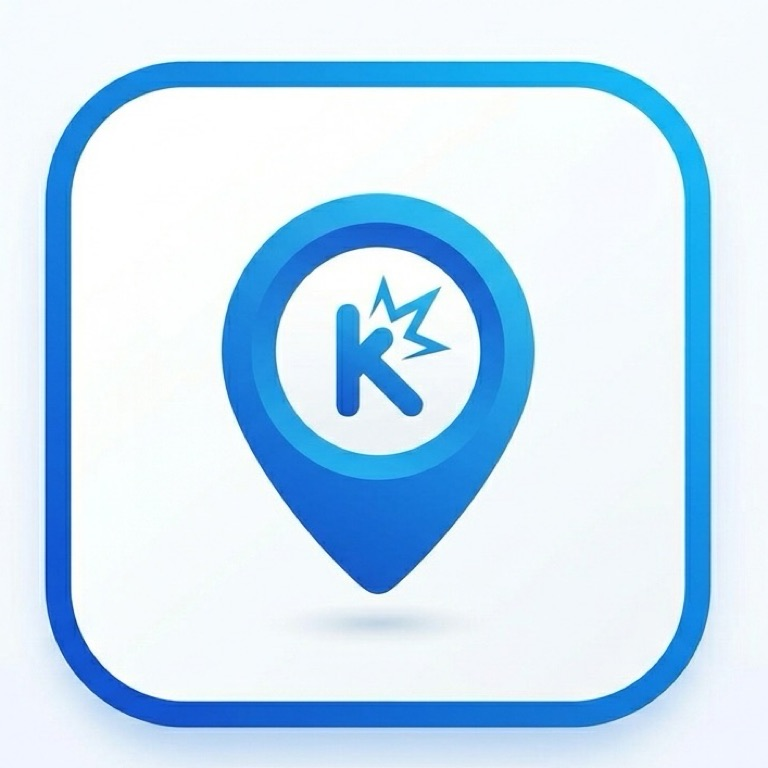

# Kando

<p align="center">
  
</p>

**কাণ্ড** — Bengali for *event*, *incident*, *episode*.

A production runtime for long-running agents where the event log is the agent, not a debugging artifact. Append-only log in, projected world out, reactive responders in between.

Kando is an opinionated production runtime. It combines an event-sourced reactive graph model with an event-native database substrate. Neither layer is modified — Kando is the layer that wires the architecture to the infrastructure.

---

## Core Vocabulary

| Kando term | What it is |
|---|---|
| **Ledger** | The append-only event log for a single agent run. One ledger per run. The source of truth. *(Backed by an append-only event stream.)* |
| **World** | The live projected state: all objects, relations, and their current data. Deterministically derived from the ledger. Never stored directly — always reconstructable. |
| **Responder** | A function (plain, LLM-backed, or tool-calling) that subscribes to event patterns, reads the world, and emits new events back to the ledger. Responders do not call each other. |
| **Edge logic** | Semantic behavior attached to a typed relation (`contradicts`, `depends_on`, `supports`, `blocks`). When the relation is created, its edge logic fires. Coordination without orchestration. |
| **Snapshot** | A materialized checkpoint of the world at a ledger position. Optimization for fast startup — the ledger remains authoritative. *(Backed by a server-side projection view.)* |
| **Branch** | A fork of a ledger at a specific position. The prefix before the branch point is shared (zero-copy, no re-execution). Each branch diverges independently. |
| **Diff** | A structural comparison of two worlds (typically parent vs. branch) showing which objects, relations, and responder outputs diverged. |
| **Cache** | Content-addressed store of LLM responses keyed by normalized request hash. On replay or branch, cached responses are served instead of making new API calls. |
| **Kit** | A domain bundle: object types, responders, tools, prompts, and policies packaged for a specific use case (diligence, research, planning). |
| **Trace** | The causal chain from any event back to the originating goal. Every event records its parent event and the responder that emitted it. |
| **Budget** | Per-run resource limits: max events, max LLM cost, max wall-clock seconds, max recursion depth. Enforced by the runtime, not by individual responders. |

---

## Architecture

```
┌──────────────────────────────────────────────────────────────┐
│                         Kando Runtime                        │
│                                                              │
│  ┌────────────────────────────────────────────────────────┐  │
│  │                    Agent Layer                         │  │
│  │                                                        │  │
│  │  Kits ─── Responders ─── Edge Logic ─── LLM Cache     │  │
│  │                                                        │  │
│  │  World (projected state: objects + typed relations)     │  │
│  │  Branch engine (fork, replay shared prefix, diff)      │  │
│  │  Trace engine (causal lineage queries)                 │  │
│  │  Budget enforcement (event/cost/time caps)             │  │
│  └──────────┬─────────────────────────┬───────────────────┘  │
│             │ append events           │ read events / views   │
│             ▼                         ▼                       │
│  ┌────────────────────────────────────────────────────────┐  │
│  │                   Event Substrate                      │  │
│  │                                                        │  │
│  │  Ledgers:    run:{id}         (per-run event log)      │  │
│  │              branch:{id}      (forked runs)            │  │
│  │              cache:llm        (content-addressed)      │  │
│  │                                                        │  │
│  │  Views:      world-state      (live object graph)      │  │
│  │              lineage-index    (causal chain lookups)    │  │
│  │              run-metrics      (cost, timing, counts)   │  │
│  │                                                        │  │
│  │  Delivery:   responder groups (persistent, competing)  │  │
│  │  Consensus:  cluster mode (multi-node)                 │  │
│  └────────────────────────────────────────────────────────┘  │
└──────────────────────────────────────────────────────────────┘
```

---

## Design Principles

**The ledger is the agent.** There is no separate "memory," no mutable state store, no conversation context that outlives its events. If it didn't happen in the ledger, it didn't happen.

**The world is derived, never stored.** Object data, relation graphs, responder state — all of it is a deterministic function of the ledger. Snapshots are a performance optimization. The ledger can always reconstruct the world from scratch.

**Responders are physics, not control flow.** A responder subscribes to a pattern. When the pattern matches, the responder fires. There is no orchestrator deciding what runs next. Chaining happens because one responder's output event matches another responder's subscription. The execution order is an emergent property of the event stream.

**Edge logic carries meaning.** A `contradicts` relation is not just data — it's a trigger. When evidence contradicts a belief, the contradiction-resolution responder fires automatically. Logic lives where the semantic meaning is, not in a central router.

**Branches are cheap.** Forking a 500-event run at position 250 replays the first 250 events from cache (zero LLM calls, sub-second) and executes only the divergent tail. This makes hypothesis testing, A/B comparison, and self-improvement loops economically viable.

**Traces are not observability.** The causal chain from goal to artifact is not a debugging tool bolted on after the fact. It is the structural output of every run, queryable at any time, and it falls out of the architecture for free.

---

## Quickstart

From a fresh clone:

```bash
git clone https://github.com/ucalyptus/kando.git
cd kando
make start
```

`make start` creates `.venv` and runs the two currently wired CLI smoke
checks directly from this checkout:

```bash
.venv/bin/python -m kando.cli.main status demo
.venv/bin/python -m kando.cli.main trace object.created-2
```

Expected output includes a demo run with three events and a causal chain
from `object.created-2` back to `object.created-0`.

### Local development

```bash
make setup
.venv/bin/python -m kando.cli.main --help
.venv/bin/python -m kando.cli.main status demo
.venv/bin/python -m kando.cli.main trace object.created-2
```

Install the package when you specifically want the `kando` console script:

```bash
.venv/bin/pip install -e .
.venv/bin/kando status demo
```

Run tests after installing the dev extra:

```bash
.venv/bin/pip install -e ".[dev]"
make test
```

### Docker / EventStoreDB

Start the event substrate:

```bash
docker compose up -d eventstore
```

Run the Kando CLI in a container:

```bash
docker compose run --rm kando python -m kando.cli.main status demo
docker compose run --rm kando python -m kando.cli.main trace object.created-2
```

Or use the Make targets:

```bash
make eventstore
make docker-status
make docker-trace
```

### Command status

The current CLI has working in-memory demo implementations for `status`
and `trace`. These commands are intentionally not wired to durable storage
yet and currently raise `NotImplementedError`:

```bash
kando run kits/diligence --goal "Evaluate Acme Corp"
kando replay <run_id>
kando fork <run_id> --at 250
kando diff <run_a> <run_b>
```

---

## References

- [ActiveGraph](https://github.com/yoheinakajima/activegraph) — event-sourced reactive graph runtime (agent abstractions)
- ["The Log is the Agent"](https://arxiv.org/abs/2605.21997) — Nakajima, May 2026
- [ESAA](https://arxiv.org/abs/2602.23193) — Event Sourcing for Autonomous Agents, Feb 2026
- [Log-Centric Agent Architecture](https://blog.ucalyptus.me/p/log-centric-agent-architecture) — the architectural thesis this project implements
