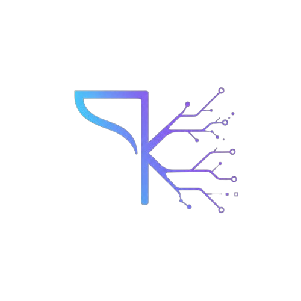

# Kando

<p align="center">
  
</p>

**কাণ্ড** — Bengali for *event*, *incident*, *episode*.

A production runtime for long-running agents where **the event log is the agent**, not a debugging artifact. Append-only log in, projected world out, reactive responders in between.

---

## What is Kando?

Kando is an opinionated production runtime that wires two foundational projects together:

- **[ActiveGraph](https://github.com/yoheinakajima/activegraph)** (Yohei Nakajima) — the event-sourced reactive graph model for agents. Provides agent-native abstractions: projected world state, reactive responders, typed edges with semantic logic, fork-and-diff, causal lineage.
- **[EventStoreDB](https://www.eventstore.com/)** — the event-native database. Provides the production substrate: native append-only streams, server-side projections, persistent delivery, cluster consensus, and a decade of operational hardening.

Neither is modified. Kando is the layer that wires the architecture to the infrastructure.

---

## Key properties

| Property | What it means |
|---|---|
| **Ledger-native** | Every agent run is an append-only event stream. No mutable state. No conversation context that outlives its events. |
| **Deterministic world** | World state is always a deterministic projection of the ledger. Replay produces the same world, every time. |
| **Reactive responders** | Functions subscribe to event patterns. When an event matches, the responder fires and emits new events. No orchestrator. |
| **Cheap branches** | Fork any run at any position. The shared prefix costs nothing to replay. Only the divergent tail executes. |
| **Causal traces** | Every event records what caused it. The full causal chain from goal to artifact falls out of the architecture for free. |
| **Budget-safe** | Hard limits on events, LLM cost, wall-clock time, and recursion depth. Enforced by the runtime, not by responders. |

---

## Get started in 60 seconds

```bash
git clone https://github.com/ucalyptus/kando.git
cd kando
make start
```

Then run your first agent:

```bash
make setup
kando run kits/diligence --goal "Evaluate Stripe"
kando run kits/research  --goal "Understand quantum computing"
```

→ [Full Quickstart](quickstart.md)

---

## References

- ["The Log is the Agent"](https://arxiv.org/abs/2605.21997) — Nakajima, May 2026
- [ESAA](https://arxiv.org/abs/2602.23193) — Event Sourcing for Autonomous Agents, Feb 2026
- [Log-Centric Agent Architecture](https://blog.ucalyptus.me/p/log-centric-agent-architecture) — the architectural thesis this project implements
